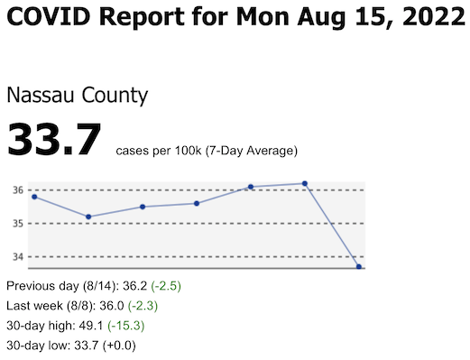

# Daily Covid Report

I made this thing for myself, because I look at this number every day and I
wanted it automatically e-mailed to me:

I'm sharing it on the off chance it's useful to anyone else. I won't be able to
help you set up, use, or modify it.

## How to use

There are two parts here. One is a standard Python Flask web application:
`app.py`. It can be deployed and run in the same way as any other web application.
There is also the `report.py` script, which will cause an e-mail to be sent,
assuming you sign up for SendGrid and supply the appropriate API key and e-mail
addresses.

## Deployment

I like containers and I like Serverless. So a Dockerfile is included to build
for easy cloud deployment. This is a very small app and I found (for me) it fits
into the [free
tier](https://cloud.google.com/free/docs/free-cloud-features#free-tier) of
Google Cloud Run and the free SendGrid plan. Your mileage may vary, don't yell
at me if you get billed. You'll also need to read the  instructions for those
services to get set up for them. I never did this before and found it
surprisingly easy.

In case it's not obvious, the idea is that you can host the web service
somewhere to look at whenever you want, and you can set up a scheduled job to
run it with a different entrypoint/command (`python report.py`) once a day to
send the e-mail.

## Environment variables

All configuration is via environment variables.

* PORT=*HTTP port. Default: 5000*
* SG_API_KEY=*SendGrid API key*
* SG_FROM_EMAIL=*Address to send e-mail report from*
* SG_TO_EMAILS=*Addresses to send e-mail report to*
* NYS_APP_TOKEN=*Optional Socrata API token (https://health.data.ny.gov/signup)*
* NYS_FILTER=*Socrata $where filter
  (https://dev.socrata.com/docs/queries/where.html). Default: county = 'Nassau'*
* POPULATION=*Population for calculating per-100k values (obtain from
  e.g.
  https://health.data.ny.gov/Health/New-York-State-Population-Data-Beginning-2003/e9uj-s3sf).
  Defaults to some number I hard coded for Nassau County.*

## What if I'm not in New York State?

You're welcome to fork this project and modify it to work for other places.
